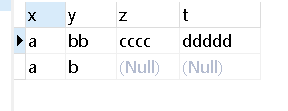
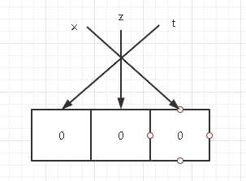
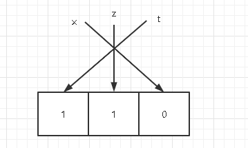
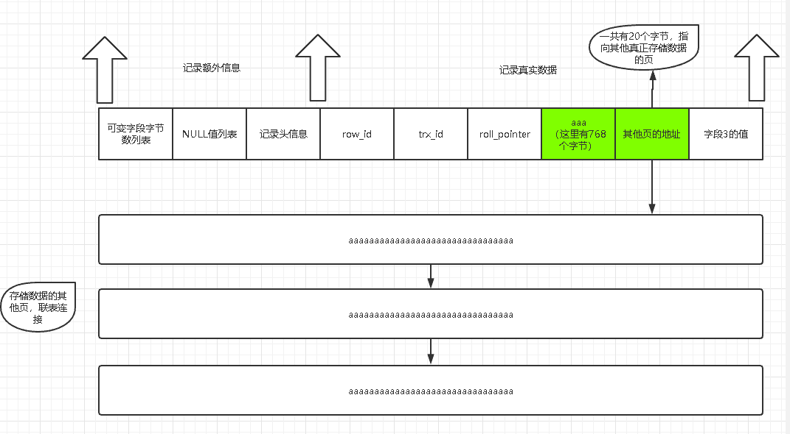

# MySQL 从一条数据说起-InnoDB行存储数据结构

先给大家讲一个故事，我刚参加工作，在一个小作坊里面当【码畜】（尽管现在也是），有一天老板从我背后走过，说了一句举世震惊的话：我看你们的数据库和excel一样，不就是一行行数据，人家excel还可以对单元格进行美化，还有各种函数，生成各种报表，你们的数据库有什么复杂的？我竟无力反驳。

为什么要说这个故事呢，当然是为了引出今天的话题——InnoDB行存储数据结构。

虽然做开发的各位，或多或少都接触过数据库，但是数据库中的一行行数据到底是怎么存储的，存储的格式又是什么，就不是每个开发都知道的了，数据库对我们而言就是一个黑盒子，你想打开这个黑盒子一探究竟吗？【不，我不想，我只想CURD】【不，这不是你的真实想法】。当我们收了快递，尽管我们已经知道是什么快递了，但是我们还是会迫不及待的拆开快递，更何况，我们面对的是未知的事物，作为人的天性，一定是非常希望可以打开这个黑盒子，更别提充满好奇心的程序猿了，今天我就带着打开这神秘的黑盒子。

这次我们打开的黑盒子便是InnoDB存储数据结构，换而言之，MySql其他的存储引擎，如Memory，MyISAM不在本次的讨论范围。

## InnoDB页简介

InnoDB是一个把数据存储在硬盘的存储引擎，即使服务器重启，数据依然不会丢失，而真正的数据处理是发生在内存中的，所以InnoDB需要把硬盘上数据加载到内存中，然后在内存中进行各种数据处理，最终在某个时机把内存中的数据刷新到硬盘。而硬盘的处理速度是很慢很慢的，和内存差的太远了，如果InnoDB每次只从硬盘中读取一条数据，显然是不行的，速度会慢死，所以InnoDB会把数据分成若干页，以页作为内存和硬盘之间交互的基本单位，说的再直白点：InnoDB读取数据不是一行一行读，而是以页为最小单位读取数据。默认情况下，一页是16K，也就是InnoDB读取数据的数据大小至少是16K。当然这个值是可以被修改的，因为一般情况下，也没人会修改这个值，所以这里我就不说明应该怎么改了。

## InnoDB行格式

之所以，文章开头的老板会认为数据库和excel是一样的，就是因为我们平时基本都是用可视化工具去管理表，去查数据，一个不懂的人乍一看，确实和excel有点像，就是一行一行数据，这些数据在硬盘上存储格式是需要我们去探究的。

InnoDB提供了4种行格式供我们选择，分别是Compact、Redundant、Dynamic和Compressed行格式，以后可能会有新的行格式出现，但是区别并不是很大。

我们建表的时候，可以指定某种行格式：

```
CREATE TABLE table_name (列信息) ROW_FORMAT=行格式名称
```

也可以修改已经存在的表的行格式：

```
ALTER TABLE  table_name ROW_FORMAT=行格式名称
```

## 准备工作

为了后面的故事可以顺利展开，我们先来建一张表：

```
CREATE TABLE  hero(
`x` VARCHAR(10),
`y` VARCHAR(10) NOT NULL,
`z` CHAR(10),
`t` VARCHAR(10)
)CHARSET=ASCII, ROW_FORMAT=COMPACT;
```

我建了一张表，指定的行格式是COMPACT，采用的字符集是ASCII，也就是我们的中文是无法存进去的，现在我要向这张表添加两行数据：

```
INSERT INTO hero(x, y, z, t) VALUES('a', 'bb', 'cccc', 'ddddd'), ('a', 'b', NULL, NULL);
```

现在表中的数据是这样的： 

表建好了，数据填充好了，下面我们就来分析下在COMPACT行格式下，数据是如何存储的吧。

## COMPACT行格式


从上图可以看到，一行数据被分为了两个部分，一部分是记录的额外信息，一部分是记录的真实数据。

### 记录额外信息

#### 变长字段字节数列表

varchar(X)和char(X)的区别是什么，相信大家都非常清楚，char是定长的，varchar是变长的，变长字段中存储多少字节的数据不是固定的，所以InnoDB在存储数据的时候，会把这些数据占用的真实字节数也保存下来，也就是变长字段是占用了两部分空间来存储的：

1.  真实的数据内容
2.  占用的字节数

在COMPACT行格式中，把所有的变长字段所占用的字节数逆序排放在变长字段字节数列表中。

我们先前创建了一张表，还准备了两条数据，现在我们来看下第一条数据中的变长字段字节数列表是什么酱紫的。

表中有四个字段，其中x，y，t三个字段都是变长字段，所以这三个字段的字节数需要保存在变长字段字节数列表，数据表采用的字符集是ascii，所以每一个字符占用的字节数是1，下面我们来看下第一条数据各个变长字段所占用的字节数：

| 字段名称 | 内容 | 占用字节数 （十进制） | 占用字节数 （十六进制） |
| --- | --- | --- | --- |
| x | a | 1 | 0x01 |
| y | bb | 2 | 0x02 |
| t | ddddd | 5 | 0x05 |

所以，第一行数据x，y，t三个字段所占用的字节数分别是1 2 5，但是InnoDB会把所占用的字节数逆序排放，如果用16进制来表示变长字段所占用的字节数就是这样的效果了： 

*为了更容易理解、清晰，所以我用了空格来分割，其实是没有的。*

由于数据的长度都比较小，用一个字节就可以表示，但是如果变长字段占用的字节数比较多，就要用两个字节来表示了，到底使用一个字节来表示，还是用两个字节来表示，InnoDB有着自己的一套规则。在说这个规则之前，要先说明下规则中用到的三个变量：

1.  W：指定字符集下，一个字符最多需要占用的字节数。比如，ascii字符集的W是1，GBK字符集的W是2，utf-8字符集的W是3。
2.  M：最多可以存储多少个字符，varchar(50)的M就是50。
3.  L：实际存储字符占用了多少字节。

W\*M：指定字段类型、字符集下，存储的字符串最多占用的字节数。

下面就是规则了：

1.  如果M\*W<=255，那么用一个字节表示字符串所占用的字节数。
2.  如果M\*W>255，则分为两种情况： 2.1 如果L<=127，则用一个字节来表示字符串所占用的字节数。 2.2 如果L>127，则用两个字节来表示字符串所占用的字节数。

光看规则是不是觉得很绕，总结一下，该可变字段允许存储的最大字节数(W\*M)>255，且真实存储的字节数(L)超过127，就用两个字节来表示字符串所占用的字节数，否则用一个字节来表示字符串所占用的字节数。

我们再来看看第二条数据，字段t的值是NULL，变长字段字节数列表只存储非NULL列内容占用的字节数，所以对于第二条数据，变长字段字节数列表只要存储x和y所占用的字节数即可，填充在变长字段字节数列表的效果是酱紫的： 

变长字段字节数列表不是必须的，如果一个表中所有的字段都不是变长的，那么就没有变长字段字节数列表了。

我们建的表采用的字符集是ascii编码的，一个字符所占用的字节固定是1，如果我们采用utf-8字符集，一个字段所占用的字节就不是固定的了，而是一个范围：1-3，所以如果我们采用这样的字符集，char(m)虽然是定长字段，但是也会被加入到变长字段字节数列表中。

#### NULL值列表

我待过一家公司，对表设计有非常明确的规定，其中有一条是任何字段都不允许为NULL，问原因，DBA只是淡淡的说了句，允许为NULL会额外占用一些空间。我也没有继续追究下去，就按照规定来呗。下面我就来揭秘为什么会有这个蛋疼的规定。

如果表中有字段允许为NULL，InnoDB就会开辟一块空间来标识每个字段实际存储的数据是不是为NULL，如果表中的字段都不允许为NULL，那么这块空间就不复存在了。

那么InnoDB开辟出来的那块空间具体是怎么回事呢，接下去往下看。

每个允许存储为NULL的字段对应一个二进制位：

+   如果字段实际存储的数据不为NULL，二进制是0。
+   如果字段实际存储的数据是NULL，二进制是1。

这里和变长字段字节数列表是一样的，是逆序排放的。

我们新建的hero表有三个字段都允许为NULL，所以存在NULL值列表。

我们先来看第一条数据，三个字段存储的实际数据都不为NULL，所以用二进制来表示是酱紫的： 

但是InnoDB是用整数字节的二进制位来表示NULL值列表的，现在不足8位，所以要在高位补0，最终用二进制来表示是酱紫的： 

所以，对于第一条数据，NULL值列表用十六进制表示是0x00。

我们再来看看第二条数据，其中z和t两个字段存储的实际数据都是NULL，我们来看看用二进制如何来表示： 

同样的，需要高位补0： 

所以，对于第二条数据，NULL值列表用十六进制表示是0x06。

我们把两条数据的NULL值列表都填充完毕是酱紫的效果： 

#### 记录头信息

记录头信息中包含的内容很多，我先随便列举几条：

1.  delete\_mask ：标识此条数据是否被删除。
2.  next\_record：下一条数据的位置。
3.  record\_type：表示当前记录的类型，0表示普通记录，1表示B+树非叶子节点记录，2表示最小记录，3表示最大记录 … 还有其他的，或者更具体的解释等以后用到了再说吧。

### 记录真实数据

对于hero表来说，记录真实数据部分除了我们定义的四个字段，还有三个隐藏字段，分别为：row\_id、trx\_id、roll\_pointer，我们来看下这三个字段是什么。

#### row\_id

如果我们建表的时候指定了主键或者唯一约束列，那么就没有row\_id隐藏字段了。如果既没有指定主键，又没有唯一约束，那么InnoDB就会为记录添加row\_id隐藏字段。row\_id不是必需的，占用6个字节。

#### trx\_id

事务Id，表示这个数据是由哪个事务生成的。 trx\_id是必需的，占用6个字节。

#### roll\_pointer

这条数据上一个版本的指针。roll\_pointer是必需的，占用7个字节。

关于 trx\_id、roll\_pointer的具体解释，在我上一篇关于事务的博客有详细描述过，感兴趣的小伙伴可以找来看看。

### VARCHAR(M)最多能存储的数据

在讲可变字段字节数列表的时候，讲到InnoDB会有一套规则，计算是用一个字节来表示实际存储的字节数，还是用两个字节来表示实际存储的字节数，但是如果存储的字符串很长很长，用两个字节都无法表示，该怎么办呢？

我们先来看看用两个字节最多可以表示的字节数是多少：  用两个字节最多可以表示的字节数是65535。

我们用这个最大字节数来试下，能不能成功创建一张表：

```
CREATE TABLE test_max ( test VARCHAR ( 65535 ) ) charset = ascii,
row_format = Compact
Row size too large. The maximum row size for the used table type, not counting BLOBs, is 65535. This includes storage overhead, check the manual. You have to change some columns to TEXT or BLOBs
```

看到了木有，两个字节最多可以表示的字节数是65535，我们用这个数字创建表竟然失败了，更别提65536了。

为什么失败呢？

从报错信息就可以知道一行数据的最大字节数是65535，其中包含了storage overhead。问题来了，这个storage overhead是什么呢？就是可变字段字节数列表、NULL值列表。

我们存储VARCHAR(M)类型的字段，其实可能分成了三个部分来存储：

+   真实数据
+   真实数据占用的字节数
+   NULL标识，如果不允许为NUL，这部分不需要

刚刚我们尝试创建的表，字段是允许为NULL的，所以会占用一个字节来存储NULL标识，真实的数据所占的字节数用两个字节来表示，所以最多可以存储65535-2-1=65532个字节。

```
CREATE TABLE test_max ( test VARCHAR ( 65532 ) ) charset = ascii,
row_format = Compact
> OK
> 时间: 0.229s
```

我们新建的表采用的字符集是ascii，如果采用的是GBK或者UTF-8，VARCHAR(M)最多能存储的数据计算方式就不一样了：

+   在GBK字符集下，一个字符最多需要两个字节，VARCHAR(M)的最大取值就是 65532⁄2\=32766。
+   在UTF-8字符集下，一个字符串最多需要三个字节，VARCHAR(M)的最大取值就是 65532⁄3\=21844。

我们上面所说的只是针对于一个列的计算方式，如果有多个列的话，要保证多个列所允许占用的最大字节数+变长字段字节数列表所占用的字节数+NULL值列表所占用的字节数<=65535。

### 行溢出

文章开头的时候，给大家简单的介绍了下页的概念，我们知道硬盘和内存之间交互的基本单位是页，而页的大小默认情况下16K，也就是16384字节，而VARCHAR(M)最多可以存储的远远不止16384字节，这样就出现了一个页存放不了一条记录的局面。

在Compact和Redundant行格式中，对于占用字节数非常大的列，在记录的真实数据中只会存储一小部分数据（768个字节），剩余的数据分散存储在其他的页，为了可以找到它们，在记录的真实数据中会记录这些页的地址，就像下面酱紫： 

## Dynamic和Compressed行格式

Dynamic和Compressed行格式和COMPACT行格式很相近，只是在行溢出的处理方式上有所不同，溢出后，Dynamic和Compressed行格式不会在记录的真实数据中存储一小部分数据，而是直接记录其他页的地址。Dynamic和Compressed行格式的区别是Compressed格式会对页进行压缩以节省空间。

Redundant行格式是MySql5.0之前使用的，现在基本不会再使用，这里就不介绍了。

* * *

